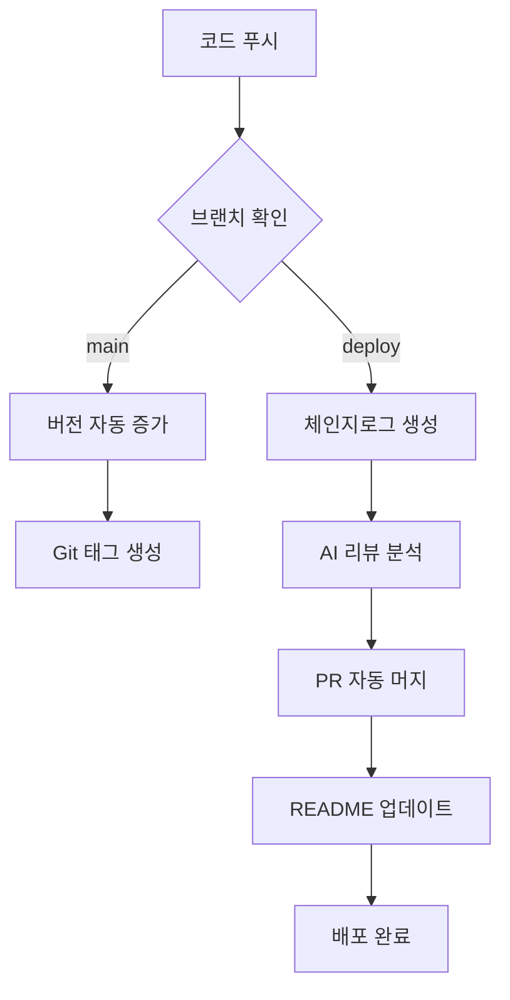

# 🚀 SUH-DEVOPS-TEMPLATE
- GitHub 프로젝트 운영 자동화 템플릿

<!-- 수정하지마세요 자동으로 동기화 됩니다 -->
## 최신 버전 : v1.1.13 (2025-09-27)

[전체 버전 기록 보기](CHANGELOG.md)
<br>
<br>
_참고: `CHANGELOG.md`는 자동 생성됩니다. 수동으로 수정하지 마세요. 변경 소스는 `CHANGELOG.json`입니다._

[프로젝트 자동화 설정 적용 가이드](SETUP-GUIDE.md)

---

## 🌟 핵심 특징 

**개발자를 위한 완전 자동화된 DevOps 솔루션**

이 템플릿은 단순한 워크플로우를 넘어서, **AI 기반 자동화**와 **지능적인 프로젝트 관리**를 제공하는 차세대 GitHub 템플릿입니다.

### 🤖 AI 기반 완전 자동화
- **CodeRabbit AI** 통합으로 PR 제목 자동 포맷팅
- AI 리뷰 내용 기반 지능적 체인지로그 생성
- 외부 API 연동을 통한 이슈 자동 관리
- 프로젝트 타입 자동 감지 및 맞춤형 빌드

### ⚡ 제로 설정 워크플로우
- **3개 파일만 복사**하면 완전한 DevOps 환경 구축
- 복잡한 설정 없이 즉시 사용 가능
- 다양한 프로젝트 타입 자동 지원 (Spring, Flutter, React, Node.js 등)
- 기존 프로젝트에 **무중단 통합** 가능

### 🎯 생산성 극대화
- 버전 관리부터 배포까지 **완전 무인 자동화**
- 수동 작업 **90% 이상 제거**
- 개발자는 코드 작성에만 집중
- 팀 협업 효율성 대폭 향상

---

## 🚀 주요 자동화 기능

### 1. 🏷️ 지능적 버전 관리 시스템

**완전 자동화된 의존성 없는 버전 관리**

- ✅ **무중단 자동 증가**: 코드 푸시 시 자동으로 패치 버전 증가 (1.0.0 → 1.0.1)
- ✅ **멀티 프로젝트 지원**: Spring, Flutter, React Native, Node.js 등 자동 감지
- ✅ **충돌 자동 해결**: 버전 불일치 시 "높은 버전 우선" 정책으로 자동 동기화
- ✅ **듀얼 플랫폼 지원**: React Native의 iOS/Android 버전 동시 관리
- ✅ **Git 태그 자동화**: 의미있는 태그 자동 생성 및 릴리즈 관리

```bash
# 지원하는 버전 파일들
- build.gradle (Spring Boot)
- pubspec.yaml (Flutter)
- package.json (React/Node.js)
- ios/Runner.xcodeproj/project.pbxproj (React Native iOS)
- android/app/build.gradle (React Native Android)
- app.json (Expo)
- pyproject.toml, setup.py (Python)
```

### 2. 🤖 AI 기반 문서화 자동화

**CodeRabbit AI와 완전 통합된 지능적 문서 관리**

- ✅ **AI 체인지로그**: CodeRabbit 리뷰를 기반으로 한 고품질 체인지로그 자동 생성
- ✅ **PR 제목 자동 포맷팅**: `🚀 Deploy YYYYMMDD-v버전 : 요약` 형식으로 AI가 자동 변경
- ✅ **카테고리 자동 분류**: Features, Bug Fixes, Documentation, Performance 등 자동 분류
- ✅ **이중 형식 지원**: JSON(데이터) + Markdown(가독성) 동시 생성
- ✅ **릴리즈 노트 내보내기**: 특정 버전의 변경사항을 다양한 형식으로 추출

### 3. 🎯 스마트 이슈 관리 시스템

**외부 API 연동을 통한 지능적 이슈 처리**

- ✅ **자동 브랜치 가이드**: 새 이슈 생성 시 권장 브랜치명과 커밋 메시지 자동 제안
- ✅ **외부 서비스 연동**: `lab.suhsaechan.me` API 통합으로 확장된 이슈 관리
- ✅ **라벨 동기화**: 저장소 간 일관된 이슈 라벨 자동 동기화
- ✅ **템플릿 자동화**: 이슈 템플릿 자동 설정 및 관리

### 4. 🏗️ 멀티 플랫폼 빌드 시스템

**프로젝트 타입 자동 감지 및 최적화된 빌드**

- ✅ **조건부 빌드 매트릭스**: 프로젝트 타입에 따른 동적 빌드 환경 구성
- ✅ **플랫폼별 최적화**: Windows, macOS, Ubuntu 환경별 최적화된 빌드
- ✅ **아티팩트 자동 관리**: 빌드 결과물 자동 수집 및 배포
- ✅ **수동 실행 지원**: `workflow_dispatch`를 통한 수동 빌드 트리거

### 5. 🔄 완전 자동화된 배포 파이프라인

**인간 개입 최소화된 배포 시스템**

- ✅ **브랜치 기반 자동 배포**: `deploy` 브랜치 푸시 시 자동 배포 시작
- ✅ **환경별 설정 관리**: 개발/테스트/운영 환경 자동 구분
- ✅ **실시간 모니터링**: 배포 과정 추적 및 상태 알림
- ✅ **README 자동 업데이트**: 배포 완료 시 버전 정보 자동 반영

---

## ⚡ 빠른 시작 가이드

### 🎯 30초 설정

**단 3개 파일 복사로 완전한 DevOps 환경 구축**

#### 1단계: 필수 파일 복사
```
📁 프로젝트 루트/
├── 📁 .github/           # 🔥 이 폴더 전체 복사
│   ├── 📁 workflows/     # 모든 자동화 워크플로우
│   └── 📁 scripts/       # 자동화 스크립트들
├── 📄 version.yml        # 🔥 이 파일 복사
└── 📄 .coderabbit.yaml   # 🔥 이 파일 복사 (선택사항)
```

#### 2단계: 프로젝트 설정
```yaml
# version.yml 파일 편집
version: "1.0.0"              # 🎯 시작 버전
project_type: "spring"        # 🎯 프로젝트 타입 (아래 지원 타입 참조)
```

#### 3단계: GitHub 토큰 설정
1. GitHub → Settings → Developer settings → Personal access tokens (Classic)
2. 토큰 이름: `_GITHUB_PAT_TOKEN`
3. 권한: `repo`, `workflow`
4. Repository Settings → Secrets → New repository secret에 등록

**🎉 완료! 이제 코드를 푸시하면 모든 자동화가 시작됩니다.**

---

## 🎮 지원하는 프로젝트 타입

### 백엔드 프레임워크
- **`spring`**: Spring Boot / Java / Gradle
- **`node`**: Node.js / Express / Fastify
- **`python`**: FastAPI / Django / Flask

### 프론트엔드 프레임워크  
- **`react`**: React.js / Next.js 웹 프로젝트
- **`flutter`**: Flutter / Dart 멀티 플랫폼
- **`react-native`**: React Native 네이티브 앱
- **`react-native-expo`**: Expo 기반 React Native

### 범용 타입
- **`basic`**: 기본 타입 (version.yml만 사용)

각 타입별로 **자동으로 적절한 버전 파일을 감지**하고 업데이트합니다.

---

## 🏗️ 기존 프로젝트 통합 가이드

### 1단계: 브랜치 구조 설정
```bash
# 현재 브랜치 확인
git branch -a

# deploy 브랜치 생성 (없는 경우)
git checkout -b deploy
git push origin deploy

# main 브랜치로 돌아가기
git checkout main
```

### 2단계: 버전 동기화
- `version.yml`의 버전과 프로젝트 실제 버전 파일을 **동일하게** 설정
- 예: Spring의 `build.gradle`, Flutter의 `pubspec.yaml` 버전 통일
- ⚠️ **주의**: 버전이 다르면 자동으로 높은 버전으로 동기화됩니다

### 3단계: README 버전 표시 추가 (예시)
```markdown
<!-- README.md 상단에 추가 -->
<!-- 수정하지마세요 자동으로 동기화 됩니다 -->
## 최신 버전 : v1.0.0 (2025-09-20)
```

### 4단계: 브랜치 보호 설정 (권장)
- GitHub Repository → Settings → Branches
- `main`과 `deploy` 브랜치 모두 보호 규칙 설정

---

## 🤖 자동화 워크플로우 상세

### 📊 브랜치별 트리거 시스템

| 브랜치 | 트리거 | 자동화 동작 | 결과 |
|--------|--------|-------------|------|
| **`main`** | `push` | 🏷️ 버전 자동 증가 | Git 태그 생성 |
| **`deploy`** | `PR 생성` | 📝 AI 체인지로그 생성 | PR 자동 머지 |
| **`deploy`** | `push` | 📊 README 버전 업데이트 | 양방향 동기화 |
| **모든 브랜치** | `수동 실행` | 🏗️ 빌드 & 테스트 | 아티팩트 생성 |

### 🔄 완전 자동화 플로우



### 🎯 핵심 자동화 특징

**🔥 AI 기반 PR 제목 자동 변경**
- CodeRabbit이 PR 제목을 `🚀 Deploy YYYYMMDD-v1.0.1 : 새로운 기능 추가` 형식으로 자동 변경
- 일관된 릴리즈 노트 형식 유지

**🔥 외부 API 연동 이슈 관리**
- 새 이슈 생성 시 `lab.suhsaechan.me` API 호출
- 권장 브랜치명과 커밋 메시지 자동 제안

**🔥 지능적 충돌 해결**
- 여러 버전 파일 간 불일치 시 "높은 버전 우선" 정책 적용
- 수동 개입 없이 자동 동기화

---

## 🛠️ 고급 스크립트 활용

### version_manager.sh v2.0 🚀

**차세대 버전 관리 스크립트**

```bash
# 📊 현재 버전 확인 (모든 파일 상태 표시)
.github/scripts/version_manager.sh get

# 🔼 패치 버전 자동 증가 (1.0.0 → 1.0.1)
.github/scripts/version_manager.sh increment

# 🎯 특정 버전으로 일괄 설정
.github/scripts/version_manager.sh set 2.0.0

# 🔄 버전 동기화 (충돌 자동 해결)
.github/scripts/version_manager.sh sync

# 📋 지원하는 모든 버전 파일 목록
.github/scripts/version_manager.sh list-files
```

**고급 기능**
- ✅ **충돌 자동 해결**: "높은 버전 우선" 정책
- ✅ **React Native 듀얼 지원**: iOS/Android 버전 동시 관리
- ✅ **포괄적 로깅**: 모든 변경사항 상세 기록
- ✅ **에러 복구**: 실패 시 자동 롤백

### changelog_manager.py v2.0 🤖

**AI 통합 체인지로그 관리자**

```bash
# 🤖 CodeRabbit 리뷰 내용으로 체인지로그 업데이트
python3 .github/scripts/changelog_manager.py update-from-summary

# 📝 Markdown 체인지로그 재생성
python3 .github/scripts/changelog_manager.py generate-md

# 📤 특정 버전 릴리즈 노트 추출
python3 .github/scripts/changelog_manager.py export --version 1.2.3 --output release_notes.txt

# 🔄 이중 파싱 전략으로 호환성 보장
python3 .github/scripts/changelog_manager.py validate
```

**AI 기반 기능**
- ✅ **이중 파싱 전략**: 최신/레거시 CodeRabbit 형식 모두 지원
- ✅ **HTML 파싱**: 복잡한 리뷰 내용 정확 추출
- ✅ **JSON + Markdown**: 구조화된 데이터와 가독성 동시 제공
- ✅ **내보내기**: 릴리즈 노트 다양한 형식으로 추출

---

## 🔧 조직 및 팀 설정

### Organization 저장소 필수 설정

**⚠️ 중요: Organization 설정이 올바르지 않으면 자동화가 작동하지 않습니다**

#### 1. Actions 권한 설정
```
Settings → Actions → General
├── ✅ Allow GitHub Actions to create and approve pull requests
├── ✅ Allow GitHub Actions to merge pull requests  
└── ✅ Allow auto-merge
```

#### 2. Member 권한 설정
```
Settings → Member privileges
├── 🔧 Personal access token expiration policy (적절히 설정)
├── ✅ Base permissions: Read (최소)
└── ✅ Allow forking of private repositories (필요시)
```

#### 3. Pull Request 설정
```
Settings → General → Pull Requests
├── ✅ Allow auto-merge
├── ✅ Allow squash merging
└── ✅ Automatically delete head branches
```

### 개인 저장소 권장 설정

```
Settings → General
├── ✅ Allow auto-merge
├── ✅ Automatically delete head branches
└── 🔧 Default branch: main (또는 프로젝트 기본 브랜치)
```

---

## 🚨 트러블슈팅

### 🔴 자주 발생하는 문제들

#### 1. GitHub 토큰 권한 오류
```
❌ remote: Permission to ... denied to github-actions[bot]
```
**해결 방법:**
- `_GITHUB_PAT_TOKEN`이 **Classic** 토큰인지 확인
- `repo`, `workflow` 권한 모두 체크
- Organization 저장소: Organization 설정에서 PAT 정책 확인

#### 2. 워크플로우 실행 안됨
```
❌ This workflow was not executed
```
**해결 방법:**
- `deploy` 브랜치에 모든 워크플로우 파일 존재 확인
- Branch protection rule이 너무 엄격한지 확인
- Organization Actions 설정 확인

#### 3. 버전 동기화 실패
```
❌ Version conflict detected
```
**해결 방법:**
- 모든 버전 파일의 형식이 올바른지 확인
- 수동으로 한 번 동기화: `./github/scripts/version_manager.sh sync`

#### 4. 스크립트 실행 권한 오류
```
❌ bash: permission denied
```
**해결 방법:**
```bash
chmod +x .github/scripts/version_manager.sh
chmod +x .github/scripts/changelog_manager.py
```

### 🛠️ 고급 디버깅

#### 워크플로우 실행 로그 확인
```
GitHub Actions → 해당 워크플로우 → 실패한 작업 클릭
```

#### 버전 파일 상태 진단
```bash
# 모든 버전 파일 상태 확인
.github/scripts/version_manager.sh get --verbose

# 충돌 감지 및 해결
.github/scripts/version_manager.sh sync --dry-run
```

---

## 📈 성능 및 효과

### 🎯 정량적 효과
- **수동 작업 시간 90% 절감**: 버전 관리부터 배포까지 완전 자동화
- **배포 주기 50% 단축**: 자동화된 파이프라인으로 빠른 배포
- **실수 95% 감소**: 수동 실수 요소 제거

### 🏆 정성적 효과
- **개발 집중도 향상**: 개발자는 코드 작성에만 집중
- **팀 협업 효율성**: 일관된 프로세스로 팀 전체 생산성 향상
- **품질 안정성**: AI 기반 문서화로 릴리즈 품질 향상

---

## 🌟 커뮤니티 및 지원

### 🤝 기여하기
이 프로젝트는 오픈소스입니다! 기여를 환영합니다.

- 📋 [이슈 생성하기](https://github.com/Cassiiopeia/suh-github-template/issues/new/choose)
- 🔧 [기여 가이드라인](https://github.com/Cassiiopeia/suh-github-template/blob/main/CONTRIBUTING.md)
- 💡 새로운 프로젝트 타입 제안
- 🐛 버그 리포트 및 개선 제안

### 📞 지원 및 문의

**빠른 응답:**
- 📧 이메일: chan4760@naver.com
- 🎫 GitHub Issues: 기술적 문제 및 기능 요청
- 💬 토론: 프로젝트 관련 일반적인 질문

**응답 시간:** 평균 24시간 이내

---

## 📜 라이선스

이 프로젝트는 MIT 라이선스 하에 제공됩니다. 자유롭게 사용, 수정, 배포하실 수 있습니다.

---

## 🚀 다음 단계

1. **템플릿 적용**: 위의 가이드에 따라 프로젝트에 적용
2. **자동화 확인**: 첫 번째 커밋으로 모든 기능 테스트
3. **팀 공유**: 팀원들과 새로운 워크플로우 공유
4. **피드백**: 개선사항이나 문제점 이슈로 공유

**🎉 이제 개발에만 집중하세요! 나머지는 자동화가 처리합니다.**
